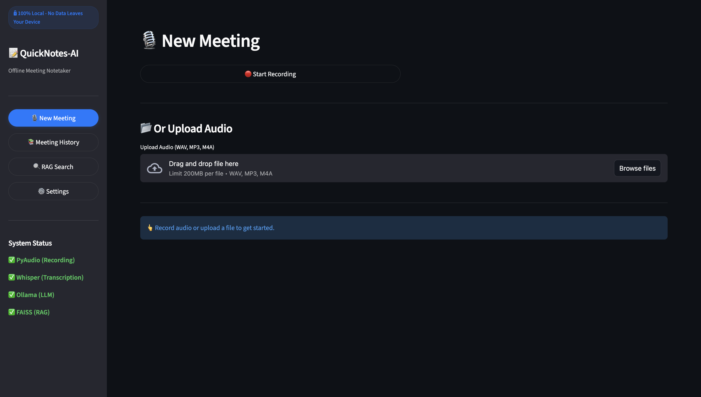
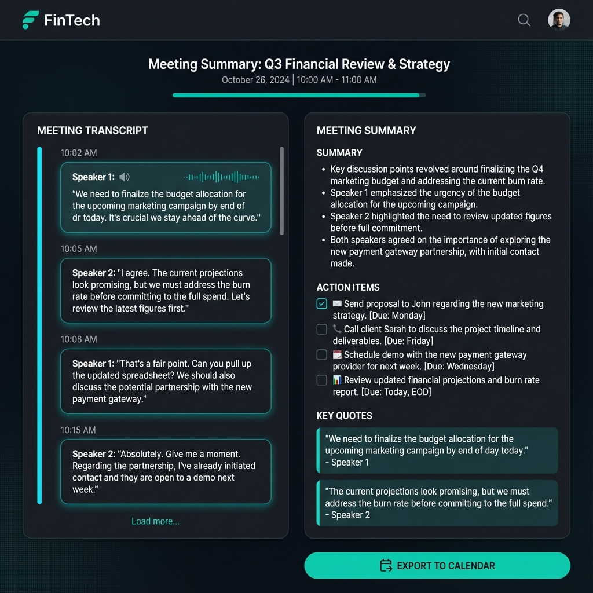
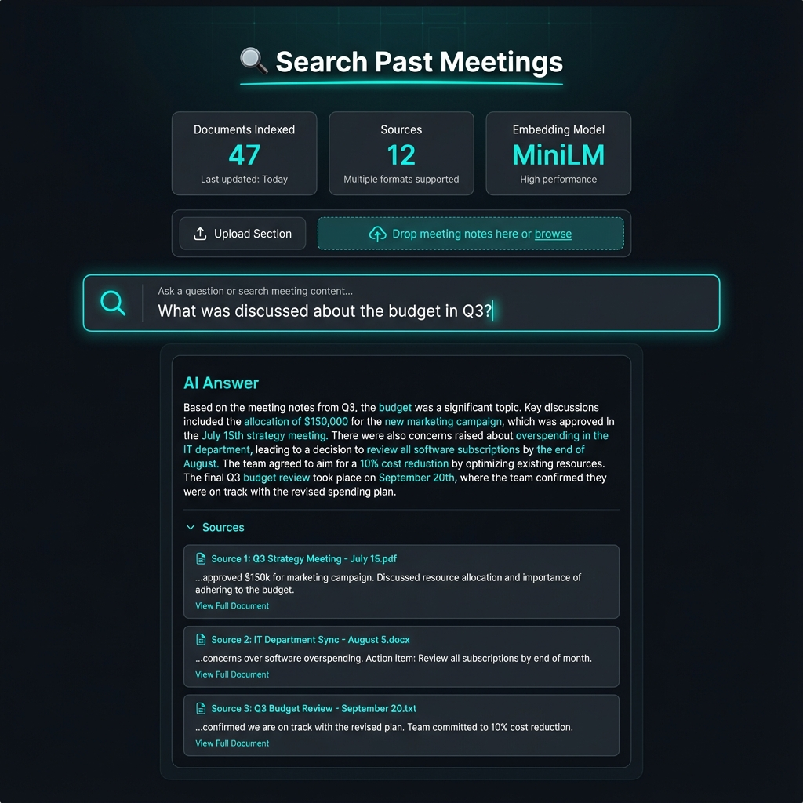
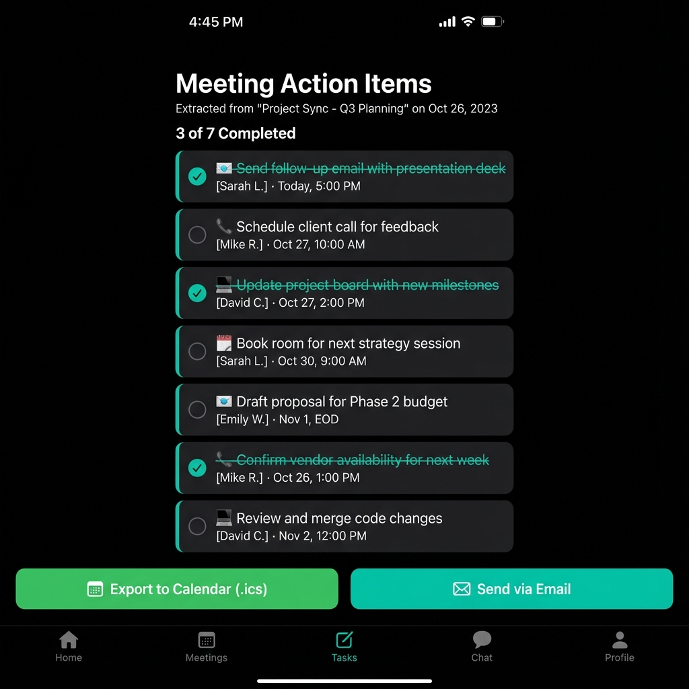

# 📝 QuickNotes-AI

[](https://www.python.org/downloads/)
[](https://streamlit.io/)

> **🔒 100% Local & Private** - All processing happens on your device. No data ever leaves your machine.

QuickNotes-AI is a powerful, offline meeting notetaker that records live audio, transcribes using Whisper, summarizes with local LLMs, extracts action items, and provides semantic search over all your past meetings—all without any paid APIs or cloud dependencies.



## ✨ Features

| Feature | Description |
|---------|-------------|
| 🎙️ **Live Recording** | Record meetings directly from your microphone using PyAudio |
| 📝 **Whisper Transcription** | Local speech-to-text with multi-language auto-detection |
| 👥 **Speaker Diarization** | Identify and attribute quotes to different speakers |
| 🤖 **AI Summarization** | Bullet-point summaries using local Ollama LLMs |
| ✅ **Action Item Extraction** | Auto-extract tasks with assignees, deadlines, and emoji tags |
| 🔍 **RAG Search** | Semantic search over all past meetings using FAISS |
| 📅 **Calendar Export** | Export action items to .ics files for Google Calendar/Outlook |
| 📧 **Email Sharing** | Send meeting summaries via SMTP (Gmail, Outlook, etc.) |
| 🏷️ **Tagging System** | Organize meetings with custom tags |
| 🌐 **Multi-language** | Whisper auto-detects 99+ languages |

## 📸 Screenshots

<details>
<summary>📊 Meeting Summary View</summary>



</details>

<details>
<summary>🔍 RAG Search Interface</summary>



</details>

<details>
<summary>✅ Action Items Checklist</summary>



</details>

## 🚀 Quick Start

### Prerequisites

1. **Python 3.10+**
2. **Ollama** (for local LLM)
3. **FFmpeg** (for audio processing)

### Installation

```bash
# Clone the repository
git clone https://github.com/yourusername/QuickNotesAI.git
cd QuickNotesAI

# Create virtual environment
python -m venv venv
source venv/bin/activate  # On Windows: venv\Scripts\activate

# Install dependencies
pip install -r requirements.txt

# Install Ollama (if not installed)
# macOS/Linux:
curl -fsSL https://ollama.com/install.sh | sh

# Pull a model
ollama pull llama2
# or
ollama pull mistral
```

### Running the App

```bash
# Start Ollama server (in a separate terminal)
ollama serve

# Run the Streamlit app
streamlit run app.py
```

Open your browser to `http://localhost:8501` 🎉

## 📦 Dependencies

All dependencies are **free and open-source**:

```
streamlit>=1.28.0        # Web UI framework
openai-whisper>=20231117 # Speech-to-text
ollama>=0.2.1            # Local LLM client
pyaudio>=0.2.14          # Audio recording
sentence-transformers    # Text embeddings
faiss-cpu>=1.7.4         # Vector search
PyMuPDF>=1.23.0          # PDF processing
icalendar>=5.0.0         # Calendar export
```

### Installing PyAudio

PyAudio requires PortAudio. Install it first:

```bash
# macOS
brew install portaudio
pip install pyaudio

# Ubuntu/Debian
sudo apt-get install portaudio19-dev
pip install pyaudio

# Windows
pip install pipwin
pipwin install pyaudio
```

## 🎯 Usage Guide

### Recording a Meeting

1. Click **"🎙️ Start Recording"** to begin
2. Speak into your microphone
3. Click **"⏹️ Stop Recording"** when done
4. Click **"🔄 Process Audio"** to transcribe and summarize

### Uploading Audio

1. Use the file uploader to upload WAV, MP3, M4A, or FLAC files
2. Click **"🔄 Process Audio"** to process

### Searching Past Meetings

1. Navigate to **"🔍 RAG Search"**
2. Upload meeting notes (.txt or .pdf) to build the knowledge base
3. Ask questions like "What was discussed about the budget?"

### Exporting Action Items

1. After processing, view extracted action items
2. Click **"📅 Export to Calendar"** to download .ics file
3. Import into Google Calendar, Outlook, or Apple Calendar

## ⚙️ Configuration

### Whisper Models

| Model | Size | Speed | Accuracy |
|-------|------|-------|----------|
| `tiny` | 39M | Fastest | Lowest |
| `base` | 74M | Fast | Good |
| `small` | 244M | Medium | Better |
| `medium` | 769M | Slow | Best |

### Email Setup (Gmail)

1. Enable 2-Factor Authentication in Gmail
2. Generate an App Password: [Google Account > Security > App Passwords](https://myaccount.google.com/apppasswords)
3. Use your Gmail and App Password in Settings

## 🌐 Deployment to Streamlit Cloud (Free)

1. **Push to GitHub**
```bash
git init
git add .
git commit -m "Initial commit"
git remote add origin https://github.com/yourusername/QuickNotesAI.git
git push -u origin main
```

2. **Deploy on Streamlit Cloud**
- Go to [share.streamlit.io](https://share.streamlit.io)
- Click "New app"
- Select your GitHub repo
- Set main file path: `app.py`
- Click "Deploy"

> ⚠️ **Note**: Some features (audio recording, Ollama) require local installation. Streamlit Cloud deployment works best for viewing past meetings and RAG search with pre-indexed data.

## 📁 Project Structure

```
QuickNotesAI/
├── app.py                  # Main Streamlit application
├── requirements.txt        # Python dependencies
├── README.md              # This file
├── .streamlit/
│   └── config.toml        # Streamlit theme config
├── src/
│   ├── __init__.py
│   ├── audio_recorder.py  # PyAudio recording
│   ├── transcription.py   # Whisper transcription
│   ├── summarizer.py      # Ollama LLM integration
│   ├── action_extractor.py # Action item parsing
│   ├── rag_engine.py      # FAISS vector search
│   ├── database.py        # SQLite storage
│   ├── email_service.py   # SMTP email
│   └── export_utils.py    # ICS export
├── assets/
│   └── mockups/           # UI screenshots
├── data/                  # Database & vector store
└── uploads/               # Uploaded audio files
```

## 🔒 Privacy & Security

- **100% Local Processing**: All AI models run on your device
- **No External APIs**: No data sent to OpenAI, Google, or any cloud service
- **Local Storage**: All data stored in local SQLite database
- **No Telemetry**: Usage statistics are disabled

## 🤝 Contributing

Contributions are welcome! Please feel free to submit a Pull Request.

1. Fork the repository
2. Create your feature branch (`git checkout -b feature/AmazingFeature`)
3. Commit your changes (`git commit -m 'Add some AmazingFeature'`)
4. Push to the branch (`git push origin feature/AmazingFeature`)
5. Open a Pull Request

## 🙏 Acknowledgments

- [OpenAI Whisper](https://github.com/openai/whisper) - Speech recognition
- [Ollama](https://ollama.com) - Local LLM runtime
- [Streamlit](https://streamlit.io) - Web UI framework
- [FAISS](https://github.com/facebookresearch/faiss) - Vector similarity search
- [SentenceTransformers](https://www.sbert.net) - Text embeddings
---

<p align="center">
  <strong>Made with ❤️ for privacy-conscious professionals</strong><br>
  <sub>Star ⭐ this repo if you find it useful!</sub>
</p>
