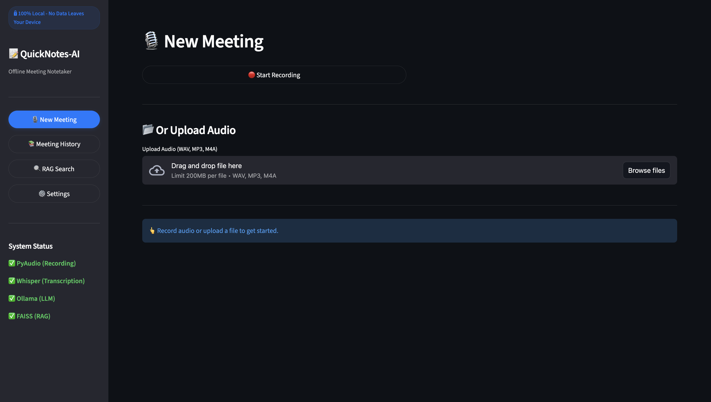
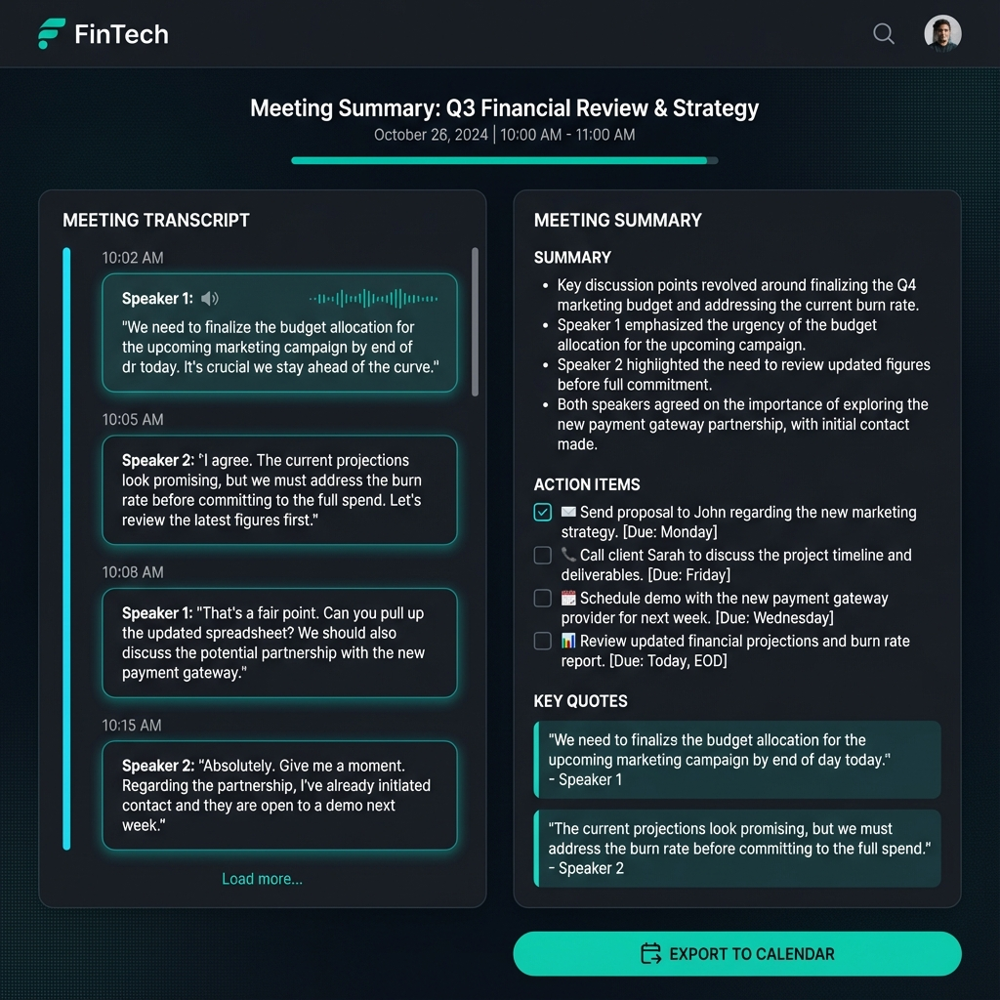
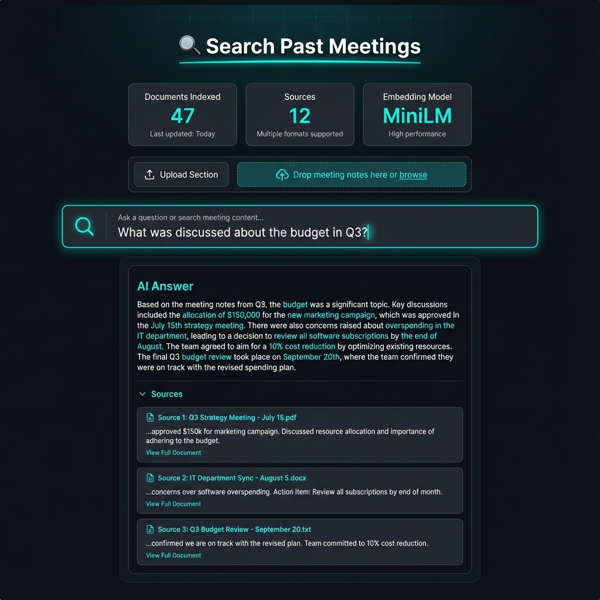
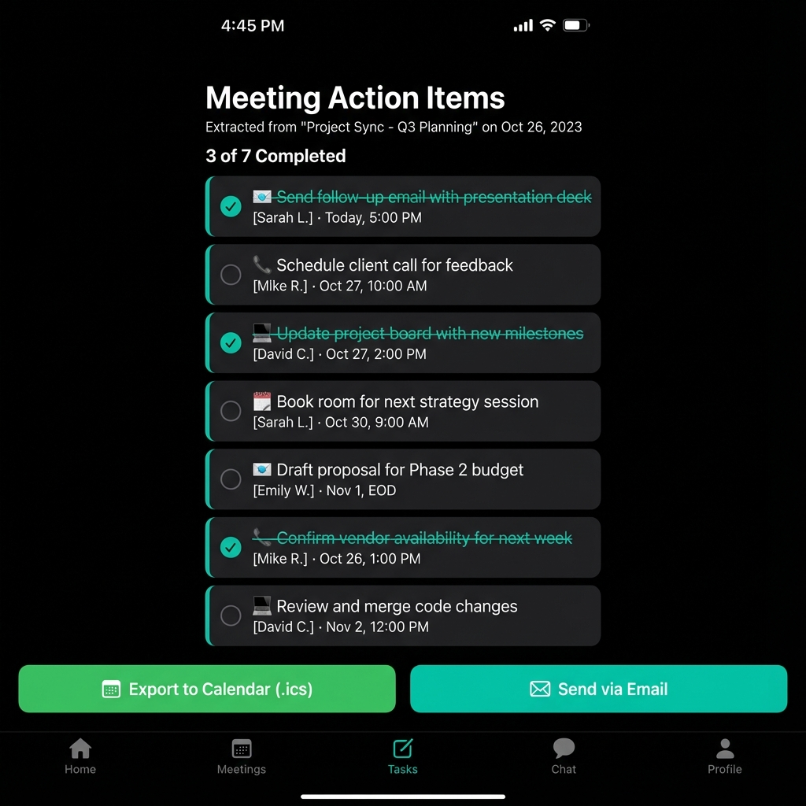

# QuickNotes-AI

[](https://www.python.org/downloads/)
[](https://streamlit.io/)
[](https://quicknotesai.streamlit.app/)

> **100% Local & Private.** All processing happens on your device. No data ever leaves your machine.

QuickNotes-AI is an offline meeting notetaker that records live audio, transcribes it with Whisper, summarizes it with local LLMs, extracts action items, and provides hybrid search over all your past meetings — without any paid APIs or cloud dependencies.



## Features

| Feature | Description |
|---------|-------------|
| **Live Recording** | Record meetings directly in the browser via the MediaRecorder API |
| **Whisper Transcription** | Local speech-to-text with multi-language auto-detection |
| **Speaker Segmentation** | Attribute quotes to different speakers using pause-based heuristics |
| **AI Summarization** | Bullet-point summaries using local Ollama LLMs |
| **Action Item Extraction** | Auto-extract tasks with assignees and deadlines |
| **Hybrid RAG Search** | BM25 + FAISS retrieval fused with RRF, refined by cross-encoder re-ranking |
| **Calendar Export** | Export action items to `.ics` files for Google Calendar / Outlook |
| **Email Sharing** | Send meeting summaries via SMTP (Gmail, Outlook, etc.) |
| **Tagging System** | Organize meetings with custom tags |
| **Multi-language** | Whisper auto-detects 99+ languages |

## Screenshots

<details>
<summary>Meeting Summary View</summary>



</details>

<details>
<summary>RAG Search Interface</summary>



</details>

<details>
<summary>Action Items Checklist</summary>



</details>

## Quick Start

### Prerequisites

1. Python 3.10+
2. [Ollama](https://ollama.com/) (for the local LLM)
3. FFmpeg (for audio decoding)

### Installation

```bash
# Clone the repository
git clone https://github.com/yourusername/QuickNotesAI.git
cd QuickNotesAI

# Create a virtual environment
python -m venv venv
source venv/bin/activate  # On Windows: venv\Scripts\activate

# Install dependencies
pip install -r requirements.txt

# Install Ollama (if not installed) — macOS/Linux:
curl -fsSL https://ollama.com/install.sh | sh

# Pull a model
ollama pull llama3.2
```

### Running the App

```bash
# Start the Ollama server (in a separate terminal)
ollama serve

# Run the Streamlit app
streamlit run app.py
```

Open your browser to `http://localhost:8501`.

## Dependencies

All dependencies are free and open-source:

```
streamlit>=1.28.0        # Web UI framework
openai-whisper>=20231117 # Speech-to-text
ollama>=0.2.1            # Local LLM client
sentence-transformers    # Dense embeddings + cross-encoder reranker
faiss-cpu>=1.7.4         # Dense vector search
rank-bm25>=0.2.2         # Sparse keyword search (BM25) for hybrid retrieval
PyMuPDF>=1.23.0          # PDF processing
icalendar>=5.0.0         # Calendar export
```

FFmpeg must be available on the system PATH. On macOS: `brew install ffmpeg`; on Ubuntu/Debian: `sudo apt-get install ffmpeg`.

## Usage Guide

### Recording a Meeting

1. Click **Start Recording** to begin.
2. Speak into your microphone.
3. Click **Stop Recording** when done.
4. Click **Process Audio** to transcribe and summarize.

### Uploading Audio

1. Use the file uploader to add a WAV, MP3, or M4A file.
2. Click **Process Audio** to process it.

### Searching Past Meetings

1. Open the **Search** page.
2. Optionally upload notes (`.txt` or `.pdf`) to extend the knowledge base.
3. Ask a question such as "What was discussed about the budget?"

### Exporting Action Items

1. After processing, review the extracted action items.
2. Click **Export to Calendar** to download an `.ics` file.
3. Import it into Google Calendar, Outlook, or Apple Calendar.

## Configuration

### Whisper Models

| Model | Size | Speed | Accuracy |
|-------|------|-------|----------|
| `tiny` | 39M | Fastest | Lowest |
| `base` | 74M | Fast | Good |
| `small` | 244M | Medium | Better |
| `medium` | 769M | Slow | Best |

### Email Setup (Gmail)

1. Enable 2-Factor Authentication in Gmail.
2. Generate an App Password: [Google Account > Security > App Passwords](https://myaccount.google.com/apppasswords).
3. Enter your Gmail address and App Password in Settings.

## Hybrid Search & Re-ranking Architecture

QuickNotes-AI's search does not rely on a single retriever. Each question runs
through a three-stage pipeline (`src/rag_engine.py` + `src/reranker.py`):

```
                        ┌─────────────────────────┐
   query ──────────────▶│ 1. Dense retrieval       │ FAISS cosine over
                        │    (all-MiniLM-L6-v2)    │ 384-dim embeddings → top-K
                        └───────────┬─────────────┘
                                    │
                        ┌───────────▼─────────────┐
   query ──────────────▶│ 1. Sparse retrieval      │ BM25 keyword scoring
                        │    (rank-bm25 / BM25Okapi)│ over tokenized chunks → top-K
                        └───────────┬─────────────┘
                                    │
                        ┌───────────▼─────────────┐
                        │ 2. Reciprocal Rank Fusion│ merge both rankings without
                        │    (RRF, k=60)           │ normalizing score scales
                        └───────────┬─────────────┘
                                    │  fused candidate pool
                        ┌───────────▼─────────────┐
                        │ 3. Cross-encoder rerank  │ ms-marco-MiniLM re-scores
                        │    (optional, PyTorch)   │ (query, passage) pairs jointly
                        └───────────┬─────────────┘
                                    │  top-N most relevant
                                    ▼
                          context → local LLM (Ollama)
```

### Why each stage matters

- **Dense retrieval** captures *meaning*: "Q3 costs" matches "third-quarter
  expenses" even with zero shared words. It is weak on rare exact tokens
  (names, IDs, acronyms).
- **Sparse retrieval (BM25)** captures *exact keywords*: it reliably finds
  "meeting_42" or "Project Andromeda" that a bi-encoder may blur away.
- **Reciprocal Rank Fusion** combines the two rankings using only *rank
  position* — `score = Σ 1/(k + rank)` — so it needs no fragile normalization
  between cosine similarities and unbounded BM25 scores.
- **Cross-encoder re-ranking** reads each `(query, passage)` pair *jointly*
  (unlike the bi-encoder that embeds them separately), producing a much sharper
  relevance signal. It is expensive, so it runs only on the small fused
  candidate pool, not the whole corpus.

### Graceful degradation

Every stage is optional and fails soft:

| Missing component | Behavior |
|---|---|
| `rank-bm25` not installed | Falls back to dense-only retrieval |
| Cross-encoder model unavailable, cannot download, or returns invalid scores | Falls back to fused (hybrid) order |
| `faiss` / `sentence-transformers` missing | Semantic search hidden; text search still works |

The **Search** page exposes toggles for hybrid search and re-ranking, and each
result shows its per-stage scores (`rerank` / `dense` / `bm25`) for transparency.

### Swapping in your own models

The reranker sits behind a small interface (`BaseReranker` in
`src/reranker.py`). To plug in a fine-tuned / LoRA cross-encoder or a hosted
reranking API, subclass `BaseReranker`, implement `is_available` and
`rerank()`, and register it once at startup:

```python
from src.reranker import set_default_reranker
set_default_reranker(MyLoRAReranker())
```

The dense embedding model is likewise swappable via the `model_name` argument
to `RAGEngine` / `get_rag_engine()`.

## Docker Deployment (Render / Railway / Cloud Run)

The included `Dockerfile` produces a production image that runs as a non-root
user, binds to the platform-provided `$PORT`, and bundles `ffmpeg` for audio
decoding.

```bash
# Build
docker build -t quicknotes-ai .

# Run locally
docker run -p 8501:8501 quicknotes-ai
# open http://localhost:8501
```

**Google Cloud Run**

```bash
gcloud run deploy quicknotes-ai \
  --source . \
  --allow-unauthenticated \
  --memory 2Gi          # embeddings + reranker need headroom
```

**Render / Railway**

- Point the service at this repository; both auto-detect the `Dockerfile`.
- No start command is needed — the image's `CMD` reads `$PORT` automatically.

> Note: the container runs Whisper, embeddings, and the reranker, but not
> Ollama. Point the app's **Ollama Server URL** at a reachable Ollama instance
> (see the Streamlit Cloud section below) to enable LLM summaries and answers.

## Deployment to Streamlit Cloud

1. **Push to GitHub**

```bash
git init
git add .
git commit -m "Initial commit"
git remote add origin https://github.com/yourusername/QuickNotesAI.git
git push -u origin main
```

2. **Deploy on Streamlit Cloud**

- Go to [share.streamlit.io](https://share.streamlit.io).
- Click "New app", select your repository, and set the main file path to `app.py`.
- Click "Deploy".

Streamlit Cloud's free tier cannot run Whisper/Ollama models directly. Run
Ollama on a machine you control and connect it to the deployed app.

**Prerequisites**

- Install [Ollama](https://ollama.com/).
- Install [ngrok](https://ngrok.com/) (for Option 1).

**Option 1: ngrok tunnel (recommended)**

```bash
# Terminal 1: start Ollama with remote access
OLLAMA_HOST=0.0.0.0 \
OLLAMA_ORIGINS="https://quicknotesai.streamlit.app" \
ollama serve

# Terminal 2: expose with ngrok
ngrok http 11434
```

Copy the ngrok HTTPS URL (for example, `https://abc123.ngrok.io`) and paste it
into the **Ollama Server URL** field in the app sidebar.

**Option 2: direct IP (requires port forwarding)**

```bash
OLLAMA_HOST=0.0.0.0 \
OLLAMA_ORIGINS="https://quicknotesai.streamlit.app" \
ollama serve
```

Forward port 11434 on your router, then enter `http://YOUR_PUBLIC_IP:11434` in
the **Ollama Server URL** field.

**Running locally instead**

For the simplest setup and full privacy, run everything on your machine:

```bash
# Terminal 1: start Ollama
ollama serve

# Terminal 2: run Streamlit
streamlit run app.py   # or ./run_app.sh
```

## Project Structure

```
QuickNotesAI/
├── app.py                  # Main Streamlit application (UI only)
├── requirements.txt        # Python dependencies
├── Dockerfile              # Production container (Render/Railway/Cloud Run)
├── .dockerignore
├── README.md
├── .streamlit/
│   └── config.toml         # Streamlit theme and server config
├── src/
│   ├── __init__.py
│   ├── audio_recorder.py   # Audio recording helpers
│   ├── transcription.py    # Whisper transcription
│   ├── summarizer.py       # Ollama LLM integration
│   ├── action_extractor.py # Action item parsing
│   ├── rag_engine.py       # Hybrid retrieval (BM25 + FAISS + RRF)
│   ├── reranker.py         # Swappable cross-encoder re-ranking
│   ├── database.py         # SQLite storage
│   ├── email_service.py    # SMTP email
│   └── export_utils.py     # ICS export
├── assets/
│   └── mockups/            # UI screenshots
├── data/                   # Database & vector store (gitignored)
└── uploads/                # Uploaded audio files (gitignored)
```

## Privacy & Security

- **Local processing.** All AI models run on your device.
- **No external APIs.** No data is sent to OpenAI, Google, or any cloud service.
- **Local storage.** Meetings are stored in a local SQLite database, which is gitignored and never committed.
- **No telemetry.** Usage statistics are disabled.

## Contributing

Contributions are welcome. To propose a change:

1. Fork the repository.
2. Create a feature branch (`git checkout -b feature/your-feature`).
3. Commit your changes.
4. Push the branch and open a Pull Request.

## Acknowledgments

- [OpenAI Whisper](https://github.com/openai/whisper) — speech recognition
- [Ollama](https://ollama.com) — local LLM runtime
- [Streamlit](https://streamlit.io) — web UI framework
- [FAISS](https://github.com/facebookresearch/faiss) — vector similarity search
- [SentenceTransformers](https://www.sbert.net) — text embeddings and cross-encoders
- [rank-bm25](https://github.com/dorianbrown/rank_bm25) — BM25 sparse retrieval
